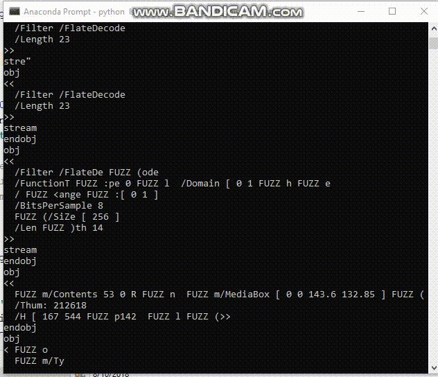

# IUST-DeepFuzz
Welcome to our new file format fuzzer, IUST-DeepFuzz, a fuzzing framework based on the deep neural languages. This project belongs to my master thesis in software engineering: ["Automatic test data generation in file format fuzzers"](https://1drv.ms/b/s!AmpQstTzvc-T003nHGvhCeNP_ZpH). We can automatically generate new, valid, and various complex structure files, mainly PDF files, as test data to use in dynamic testing of real word application, e.g. PDF reader applications. For more information about both the theoretical and practical aspect of IUST-DeepFuzz, refer to the IUST-DeepFuzz relevant paper and thesis as in the following:

* [Format-aware Learn&Fuzz: Deep Test Data Generation for Efficient Fuzzing](https://arxiv.org/abs/1812.09961v2)
* [Automatic Test Data Generation in File Format Fuzzers](https://1drv.ms/b/s!AmpQstTzvc-T003nHGvhCeNP_ZpH) (In Persian)

## Thesis: Bring Deep Neural Network to Fuzz Testing
Fuzz testing (Fuzzing) is a dynamic software testing technique. In this technique with repeated generation and injection of malformed test data to the software under test (SUT), we are looking for the possible faults and vulnerabilities. To this goal, fuzz testing requires varieties of test data. The most critical challenge is to handle the complexity of the file structures as program input. Surveys have revealed that many of the generated test data in these cases follow restricted numbers and superficial paths, because of being rejected by the parser of SUT in the initial stages of parsing. Using the grammatical structure of input files to generate test data lead to increase code coverage. However, often, the grammar extraction is performed manually, which is a time consuming, costly and error-prone task. 

In this thesis, we proposed an automated method for hybrid test data generation. To this aim, we apply neural language models (NLMs) that are constructed by recurrent neural networks (RNNs). The proposed models by using deep learning techniques can learn the statistical structure of complex files and then generate new textual test data, based on the grammar, and binary data, based on mutations. Fuzzing the generated data is done by two newly introduced algorithms, called neural fuzz algorithms that use these models. We use our proposed method to generate test data, and then fuzz testing of MuPDF complicated software which takes portable document format (PDF) files as input. To train our generative models, we gathered a large corpus of PDF files. Our experiments demonstrate that the data generated by this method leads to an increase in the code coverage, more than 7%, compared to state-of-the-art file format fuzzers such as American fuzzy lop (AFL). Experiments also indicate a better learning accuracy of simpler NLMS in comparison with the more complicated encoder-decoder model and confirm that our proposed models can outperform the encoder-decoder model in code coverage when fuzzing the SUT.

### The PDF File Generation Process 
 

### New PDF Files

## About
### Version 0.1
The main purpose of this version is to implement a free version of learn and fuzz paper and improve the **learn\&fuzz algorithm**.

### Version 0.2
This version implements four new deep models and two new fuzz algorithms: DataNeuralFuzz and MetadataNeuralFuzz as our contribution in mentioned thesis.

### FAQs
This repository is under *active development* and it dose not documented well. If you have downloaded source code or have forked it and have any questions, then feel free to email me (*m-zakeri@live.com*) and get more information. You may see the main [references](reference.md) or look at our large [test corpus](dataset).

July 5, 2019
